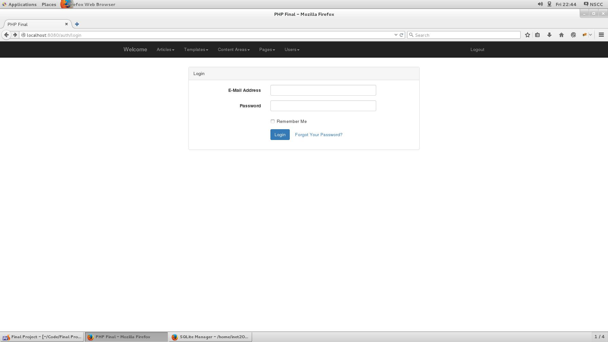
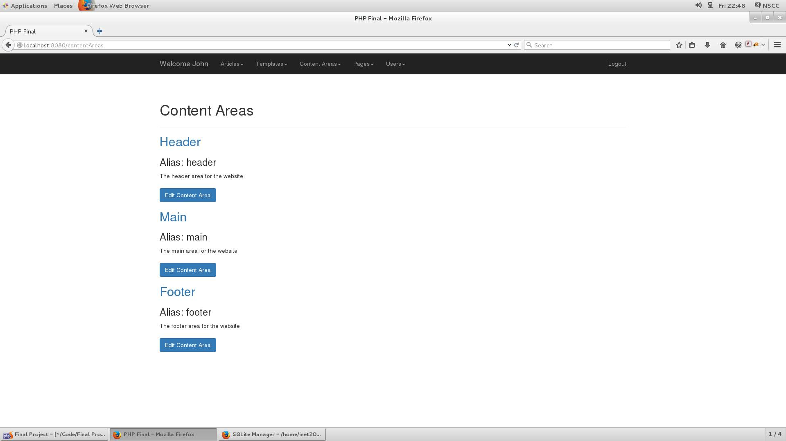
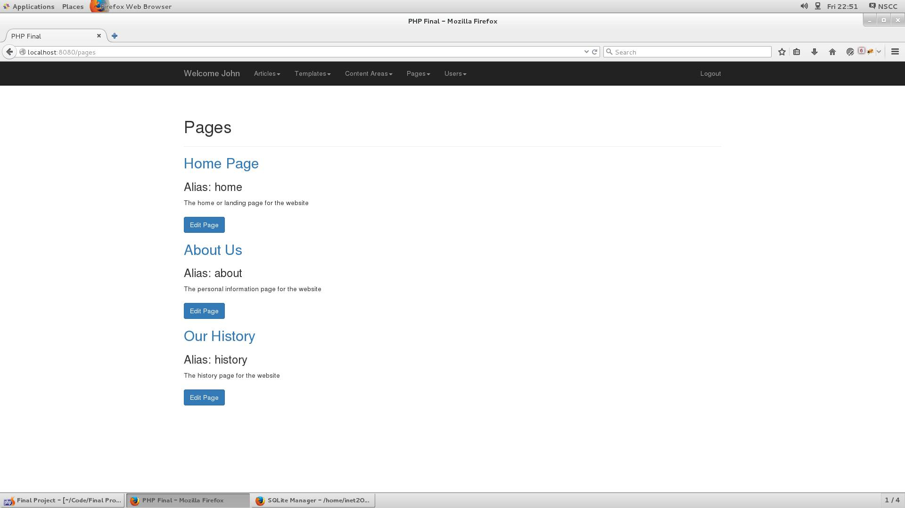
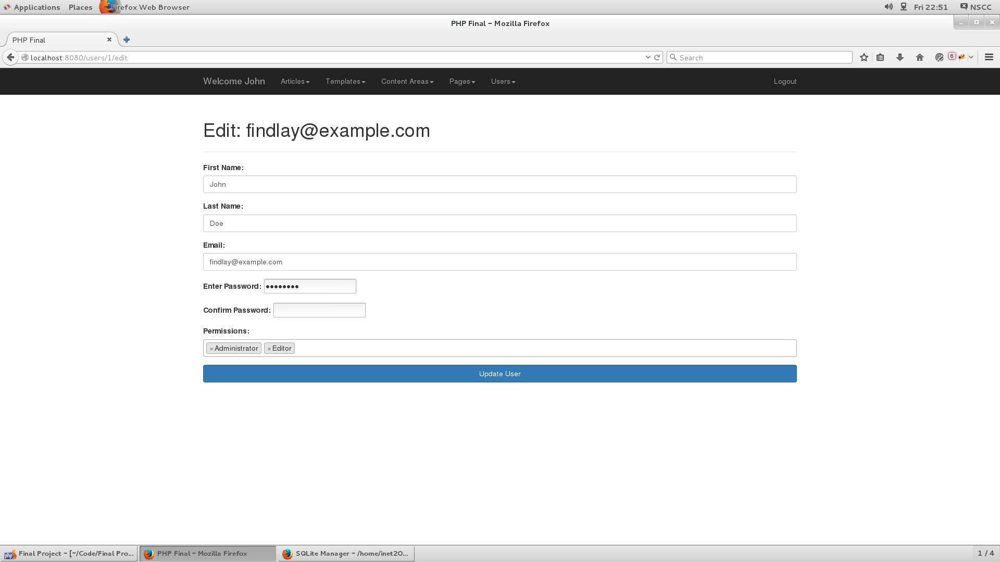
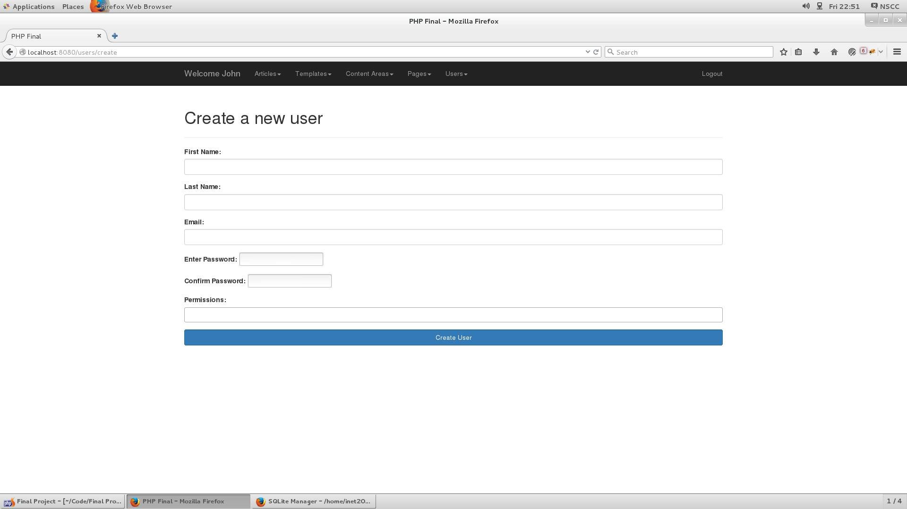
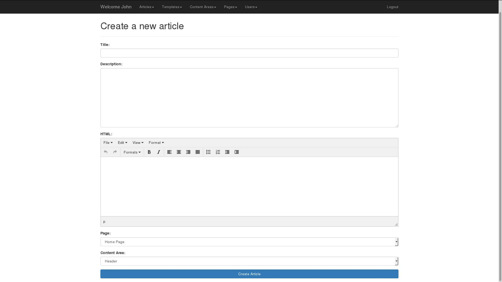
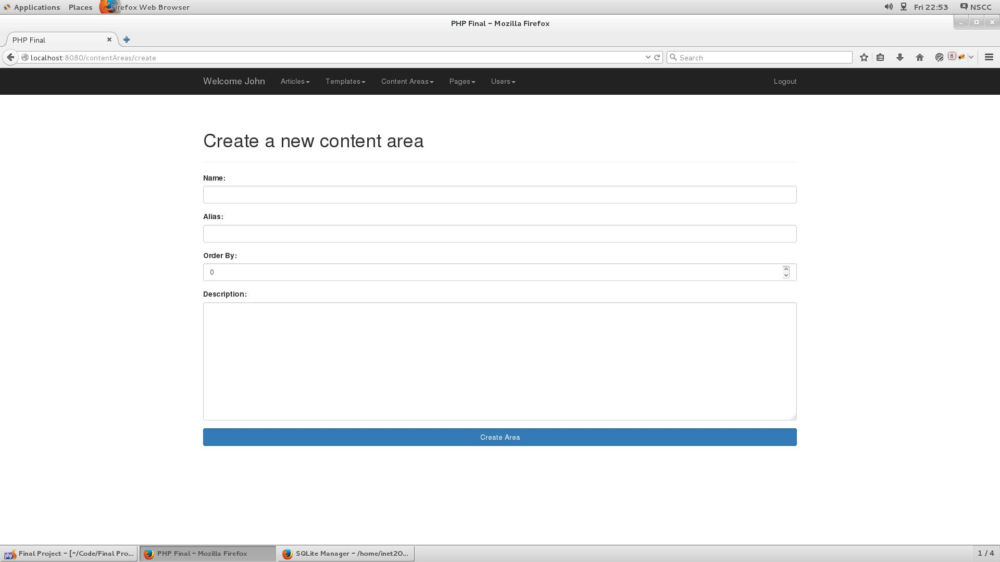
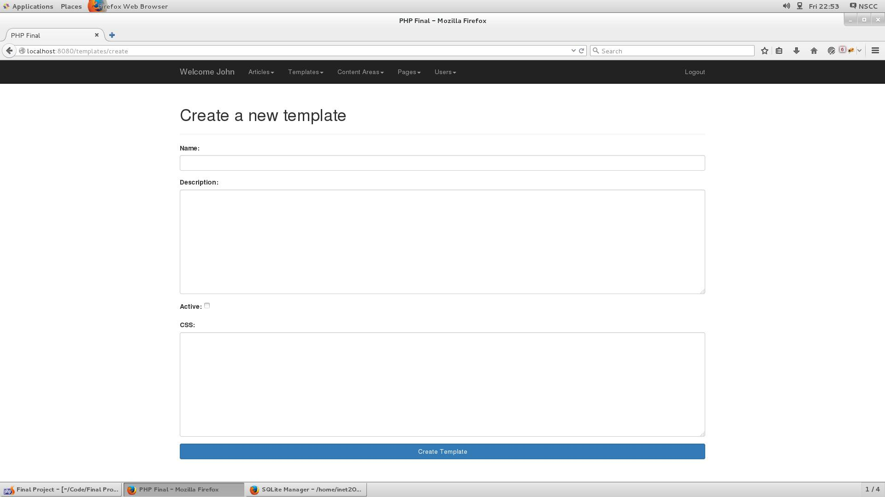
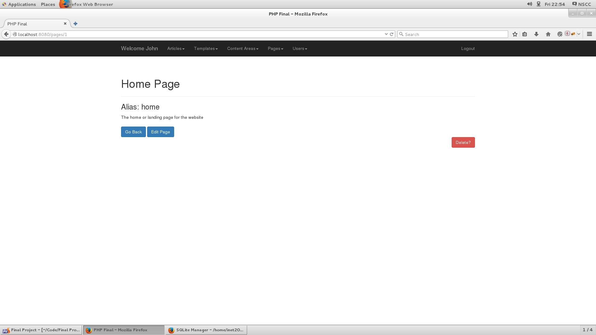

# PHP Final Project
Findlay Hilchie &amp; Christian Hapgood

User Auth

Add, edit, and organize areas

Add, edit and organize pages

Create or edit users as an admin

Create or edit users as an admin

Create or edit articles or posts as an editor or author

Create or edit content areas as an editor or author

Create custom CSS templates for each content area or the page

Full CRUD

